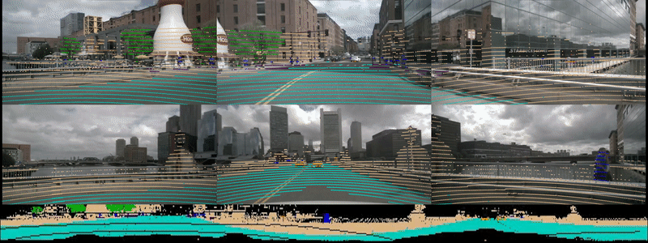
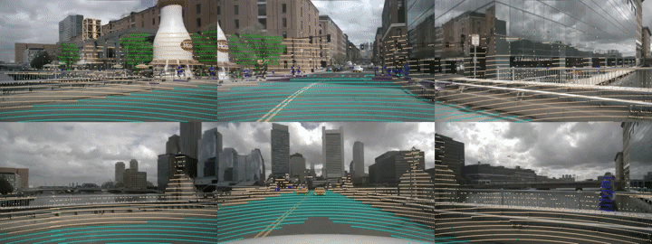
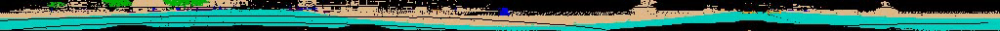

# DLA_ATTN_Net

This repository contains a Pytorch implementation of DLA_ATTN_Net. The visulization results can be found here:
<!-- [//]: # (![Video]&#40;results/camera_lidar.gif&#41;) -->
<!-- [//]: # (![Video]&#40;results/fcbccedd61424f1b85dcbf8f897f9754.gif&#41;) -->
<!-- [//]: # (![Video]&#40;results/range_image.gif&#41;) -->

# Results on nuScenes Benchmark
Quantitative results on nuScenes Benchmark compared to state-of-the-art methods are:

|   Method       | Parameters | mIoU | car | pedistrian| bicycle | motorcycle | bus | truck | const. vehicle | trailer | barrier | traffic cone | drive. surface | other flat | sidewalk | terrain | manmade | vegetation |
| ---------------|------------|------|-----|-----------|---------|------------|-----|-------|----------------|---------|---------|--------------|----------------|------------|----------|---------|---------|------------|
| RangeNet++     | 50.4       | 65.5 | 80.9| 69.6      | 21.3    | 66.8       | 77.2| 72.3  | 30.2           | 54.2    | 66.0    | 52.1         | 94.1           | 66.6       | 63.5     | 70.1    | 83.1    | 79.8       |
| PolarNet       | 14.0       | 71.0 | 90.9| 71.3      | 28.2    | 77.5       | 85.3| 76.1  | 35.1           | 57.4    | 74.7    | 58.8         | 96.5           | 71.1       | 74.7     | 74.0    | 87.3    | 85.7       |
| Salsanext      | $${\color{blue}7.1}$$        | 72.2 | 88.4| 72.2      | 34.1    | 72.4       | 85.9| 76.5  | 42.2           | 61.3    | 74.8    | 63.1         | 96.0           | 70.8       | 70.8     | 71.5    | 86.7    | 84.4       |
| Ours           | 8.1       | 75.4 | 90.5| 75.1      | 35.3    | 77.5       | 92.0| 84.0  | 51.1           | 66.8    | 77.1    | 63.2         | 96.5           | 70.4       | 75.2     | 74.9    | 89.3    | 87.8       |

<!-- | RangeNet++     | 29.5 |68.8 |16.0    |4.1         |3.3    |12.9    |13.1       |0.9           |85.4  |
|SqueezeSegV2    | 39.7 | 81.8|18.5    | 17.9       |13.4   |20.1    |25.1       |3.9           |88.6  |
| RangeNet21     | 47.4 |85.4 |26.2    |26.5        |18.6   |31.8    |33.6       |4.0           |91.4  |
| RangeNet53     | 49.9 |86.4 |24.5    |32.7        | 25.5  |36.2    |33.6       |4.7           |**91.8**|
|SqueezeSegV3-21 |48.8  |84.6 |31.5    |32.4        | 11.3  |39.4    |36.1       |**21.3**      | 90.8 |
|SqueezeSegV3-53 |52.9  |87.4 |35.2    |33.7        |29.0   | 41.8   |39.1       | 20.1         | **91.8**|
|SqueezeSegV3-21*|51.6  |89.4 |33.7    |34.9        |11.3   |42.6    |44.9       |21.2          |90.8|
|SqueezeSegV3-53*|**55.9**|**92.5**|**38.7**|**36.5**|**29.6**|**45.6**|**46.2** | 20.1         | 91.7 | -->

<!--  -->
<!--  -->
